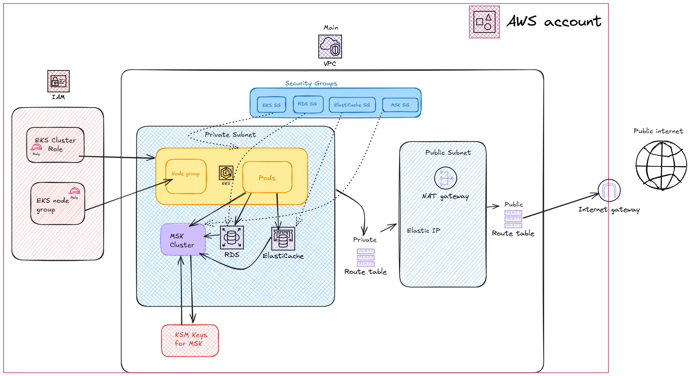
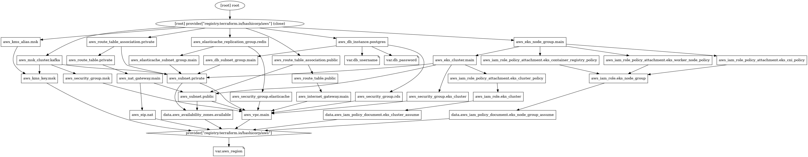

# Ebury-ing

This is an example of a company building a new web application with a microservices architecture. They want to deploy this application in the cloud using terraform to manage the
infrastructure. The application consists of several microservices, each with its own data
storage requirements.

## Structure

#### Programming set up

The repository has Github actions to check the terraform, init, validate and plan. It will not apply.

### Cloud provider

The company wants to have a microservices architecture using K8S and it is cloud agnostic. Therefore, we will deviate from overusing a specific cloud provider.

In this case, we will start by using AWS with Terraform instead of Cloudformation.

###### AWS creds
In this example, I will just use OICD (OpenID) for github, as the repo will have a pipeline init, fmt and planning the terraform, potentially adding more commands as I go (I will not be applying for this example).

Assumption: I assume this will be different in a production set up. Which would change the pipeline according to the production set up the company might have.

###### Terraform

We will use terraform, with the AWS provider. We will save the state in an S3 bucket. We will use the latest version `6.11.0`.

Assumption: I am using the latest version, as I am relaying on the latest terraform documentation.

### Networking

We want to have both pieces of public and private subnets for the microservices:

##### *Proposal*:

- NAT Getaway -> For private subnets to get outbound internet access
- Internet Getaway -> For the public route table to access the internet
- Traffic routing for both private and public
- All of them within a VPC. For this purpose we will just create one VPC for it.

Assumption: We only want outbound traffic to the public internet.

### Compute

As stated, we want to deviate from AWS.

##### *Proposal*:
- EKS: We will use EKS in this case for our container orchestration.

Note: I forgot to add LoadBanlancers in the cluster, it will be a good idea to add some in the future.

- Assumption: In terms of the EKS, this is just an extremely basic set up. Scaling settings inside the EKS cluster would be enough. However, I would like to see how the infra in general is set up. Would like to see some Helm files. I am assuming the company has, so I won't replicating that here.

### DB

For this specific example the microservices need:
- RDS
- ElastiCache
- A Managed Kafka service -> MSK in our case.

Assumption: We are adding MSK because we want it to be managed by AWS. However, same as HPA, it would be worth looking at the actual infra and check if there is a platform, with Helm charts.

 
A full graph of the services used

### Things to do:

- General clean up
- Add ALB in the cluster.
- Come up with DB creds, its throwing deprecated logs right now.
- Add environment tags to test in testing environments.
- Perhaps if needed, add the graph command in the pipeline and if using github store it in artifacts.

